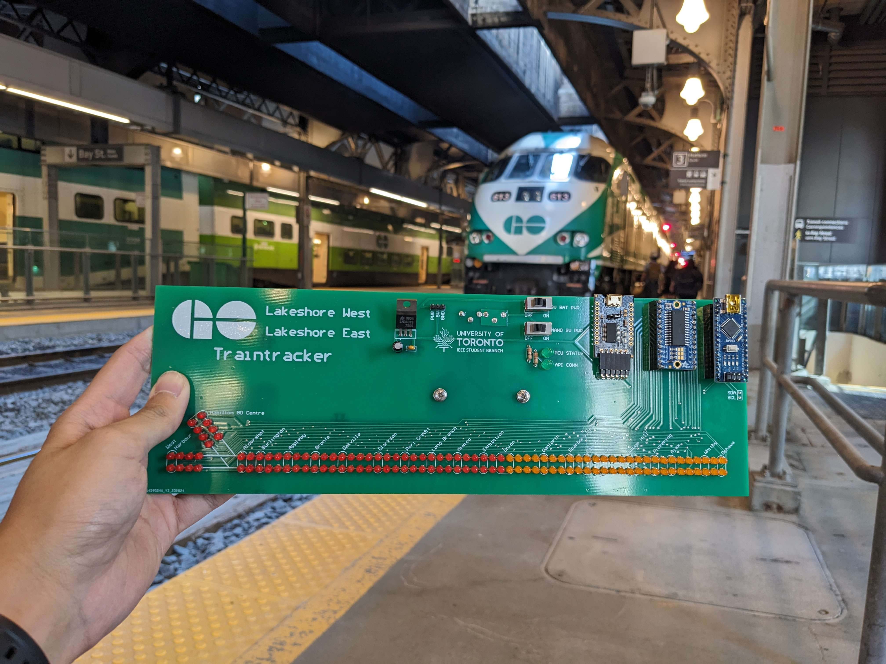
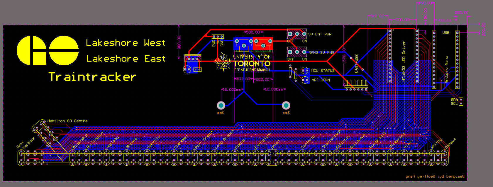
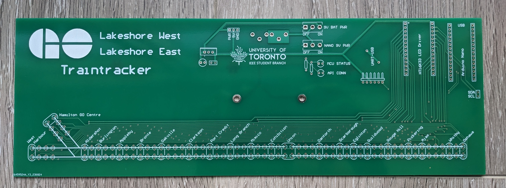
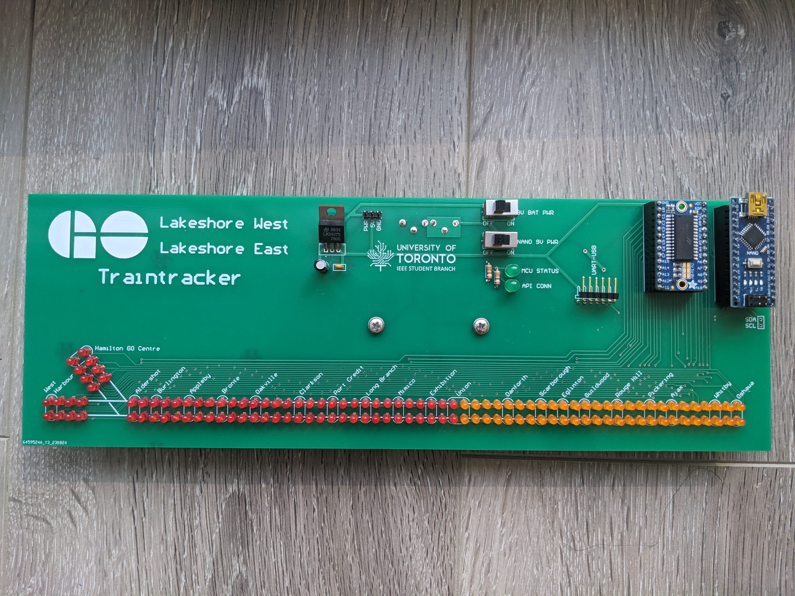

# Traintracker
Traintracker is an interactive way to track regional GO trains on the Lakeshore West and Lakeshore East GO rail corridors. Built using a custom-made PCB that communicates to an API providing real-time train data, this project combines all aspects of electrical engineering, from circuitry to embedded design and programming to software backend systems. 

##  How It Works
Real-time train locations are displayed on a custom PCB with 130 LEDs representing a rough to-scale map of the two GO train lines. Real-time train location coordinates are pulled from the official GO transit API using a Python script and then sent serially to an Arduino Nano. The Arduino Nano then communicates via I2C an LED driver which powers the LED map. 

The PCB has its own built-in power source - all that is needed for the PCB to start displaying GO trains is a USB connection to a computer running the Python script that calls the GO API. 

The Python script calls the GO API every 10 seconds and maps the location of the trains to specific LEDs on the PCB. A string is then sent serially to the Arduino Nano on the PCB with instructions on which LEDs need to be turned on. The Python script maps the location of trains to LEDs by using the ETA of trains to the next stop and the scheduled amount of time each station-to-station journey takes. 

The Arduino Nano decodes the string sent from the Python script and writes to the LED driver buffer which LEDs need to be powered on. The PCB board updates every 10 seconds, corresponding to the frequency of API calls. 

Watch the board in action here: 

## Background
This project was developed with the support of the University of Toronto IEEE Student Branch over Summer 2023 as a project to demonstrate the technical capabilities of the Tech Team at IEEE. The project was displayed at several club fairs during Frosh Week at the University of Toronto.

The PCB was designed in Altium Designer, and manufactured by JLCPCB. 

The electrical components were sourced from Digikey and Creatron. 
## Acknowledgements
Geoffrey Fang was the project manager and the lead designer of the project from front to back. He focused on the electrical and embedded design of the project. He was also in charge of the logistics of the project, ensuring the funding and components were available when needed during development. 

Scott Hirano focused on the development of the backend Python scripts and provided constant liason with UofT IEEE Student Branch leads. 

